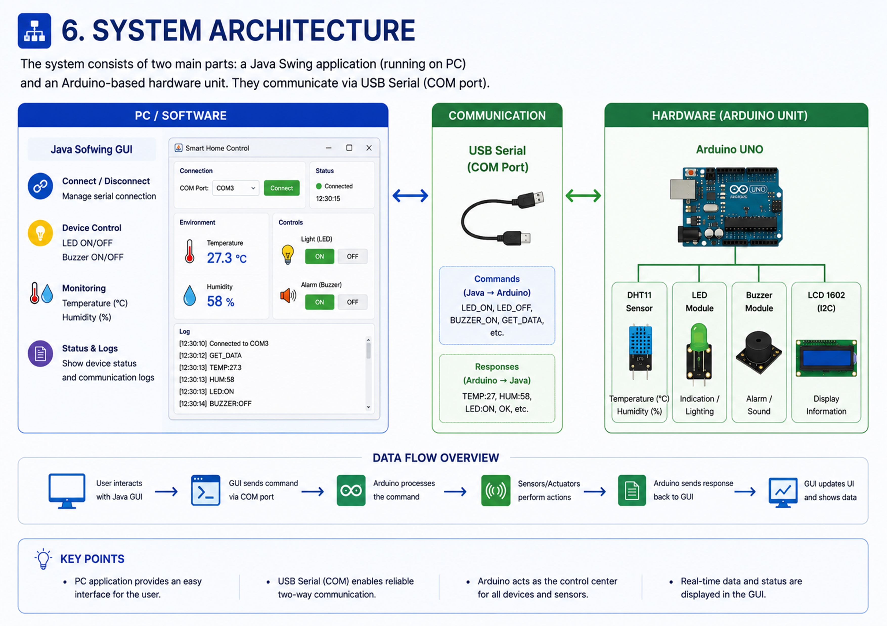

# Smart Home Control System

Java Swing GUI ↔ Arduino Smart Home Control System using USB Serial communication (COM port).
## Title Page

---

# Overview

This project demonstrates communication between a Java Swing desktop application and Arduino UNO through USB Serial communication.

The system allows the user to:
## System Architecture

* control LED lighting
* activate/deactivate buzzer alarm
* monitor temperature and humidity
* display real-time sensor data
* show device status and logs

The project simulates a simple Smart Home Control System with a graphical user interface.

---

# Features

* Java Swing graphical interface
* USB Serial (COM port) communication
* LED ON/OFF control
* Buzzer ON/OFF control
* Temperature monitoring
* Humidity monitoring
* Real-time data display
* Communication logs
* LCD 1602 display support

---

# Hardware Components

* Arduino UNO
* DHT11 Temperature & Humidity Sensor
* LED Module
* Passive Buzzer Module
* LCD 1602 + I2C
* Breadboard
* Jumper wires
* USB cable

---

# Software Technologies

* Java Swing
* Arduino IDE
* jSerialComm Library
* USB Serial Communication

---

# System Architecture

```text
Java Swing GUI (PC)
        ↓
USB Serial Communication (COM Port)
        ↓
Arduino UNO
        ↓
Sensors & Actuators
(DHT11, LED, Buzzer, LCD)
```

---

# Serial Protocol

## Commands (Java → Arduino)

```text
LED_ON
LED_OFF
BUZZER_ON
BUZZER_OFF
GET_DATA
```

## Responses (Arduino → Java)

```text
TEMP:27
HUM:58
LED:ON
LED:OFF
BUZZER:ON
BUZZER:OFF
OK
```

One message equals one line.

---

# Wiring Diagram

## DHT11 Sensor

```text
VCC → 5V
DATA → D2
GND → GND
```

## LED Module

```text
VCC → 5V
IN → D8
GND → GND
```

## Buzzer Module

```text
VCC → 5V
IN → D9
GND → GND
```

## LCD 1602 + I2C

```text
VCC → 5V
GND → GND
SDA → A4
SCL → A5
```

---

# Screenshots

## Proposal Slides

* Project Idea
* Components
* Draft Protocol
* System Architecture
* Hardware Connection Diagram

## Application Screenshots

* Java GUI
* Arduino Setup
* Working Demo

---

# Project Structure

```text
SmartHomeControlSystem/
│
├── Arduino/
│   └── smart_home.ino
│
├── JavaApp/
│   ├── src/
│   ├── lib/
│   └── screenshots/
│
├── presentation/
│
├── docs/
│
├── README.md
│
└── LICENSE
```

---

# How to Run

1. Connect Arduino UNO to PC using USB cable.
2. Upload Arduino sketch using Arduino IDE.
3. Open Java Swing application.
4. Select COM port.
5. Press Connect.
6. Control devices and monitor sensor data.

---

# Future Improvements

* Wi-Fi support
* ESP32 integration
* Mobile application
* Database logging
* Remote monitoring system

---

# Author

**Farokhitdin Artikgaliev**
Course Projects 2 — Java
May 2026
